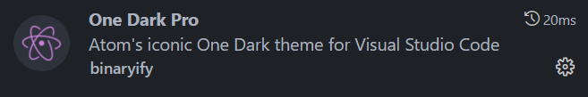

# 20230822 VSCode DIY2

由于不可避免的需要在Windows下处理一些代码（笔记本还没装虚拟机），而且VScode中有一个HDL插件比较好用，花了两天时间大概配置了一下VScode。配置成了Vim like的VScode。这个文档简单记录下配置内容。

## 安装

配置文件为settings.json和keybindings.json

- settings.json：VScode的整体配置文件，配置了编辑器的主要功能和which keys，以及部分快捷键
- keybindings.json：VScode的键位配置文件，配置了其他快捷键

## 键位说明

尽量做到了与之前的nvim相同（但是目前感觉其实还挺难的，采用了一些折中）

**<leader>键为<space>**

| 水平分屏 | <leader>+sh |
| --- | --- |
| 垂直分屏 | <leader>+sv |
| 退出文件/分屏 | :q |
| 打开左侧边栏 | <leader>+e |
| 打开右侧边栏 | <leader>+o |
| which key键 | ; |
| 打开文件浏览器 | ;+e |
| 打开下边栏（命令行等） | Ctrl+p或者Ctrl+\ |
| 切换tab | Ctrl+tab |
| 上下左右移动 | (normal模式下)hjkl |
| 导航框内移动/各个窗口内移动 | Ctrl hjkl |
待续，在后续使用中补充
## 插件安装

1. 外观类
- **One Dark Pro**

一个VScode主题，也是目前我正在使用的主题。

- **VScode icon**

一个图标主题，各种图标（有默认没有的诸如Verilog的图标）

- **Material Icon Theme**

另一个图标主题，但是好像也没有Verilog

1. 操作类
- **Vim**

核心插件，使用Vim操作的逻辑来使用vscode，需要在settings.json中修改键位

- **multi-command**

可以实现键位对应多个指令（某些vim下的操作要调用多次VScode指令）

1. 语言服务类
- **Clangd-Format**

C++的formatter

- **clangd**

C/C++的语言服务，提供代码高亮，自动补全，linter，formatter等功能

- **Prettier**

多语言功能的formatter，需要设置

- **Pylance**

Python在VScode中的语言服务

- **Python**

Python环境for VScode

- **svlangserver**

System Verilog, Verilog的语言服务，需要配置

- **TerosHDL**

一个HDL集成开发环境插件，可以支持linter，formatter，一键生成testbench等功能（也是下决心配置vscode的主要原因）

1. 其他
- **GitLens**

好用的git管理插件，在行间显示git记录，git graph等

- **CodeSnap-plus**

可以生成好看的代码截图

